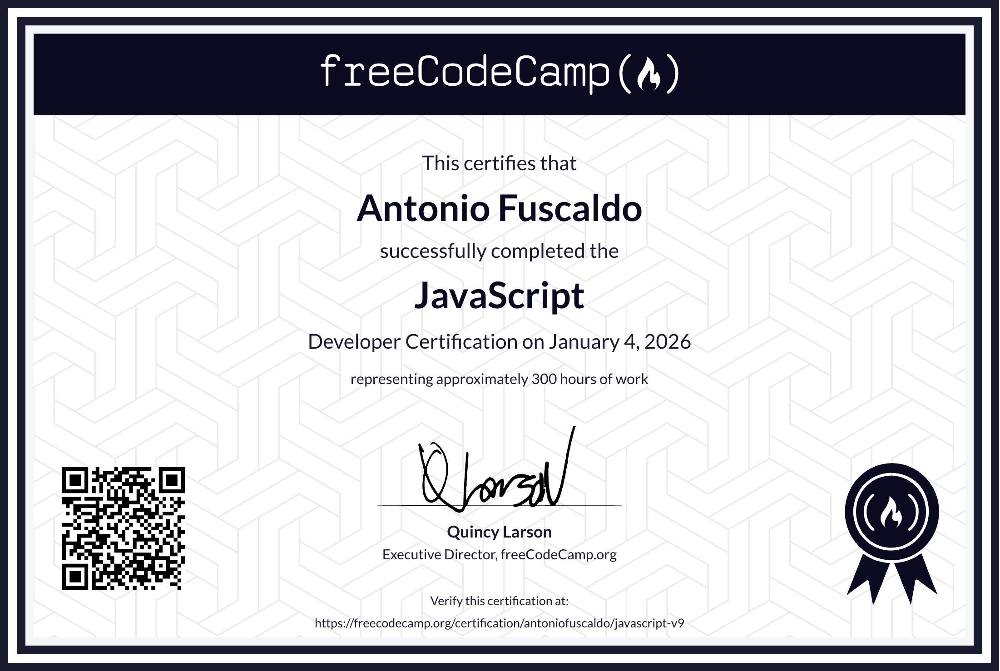
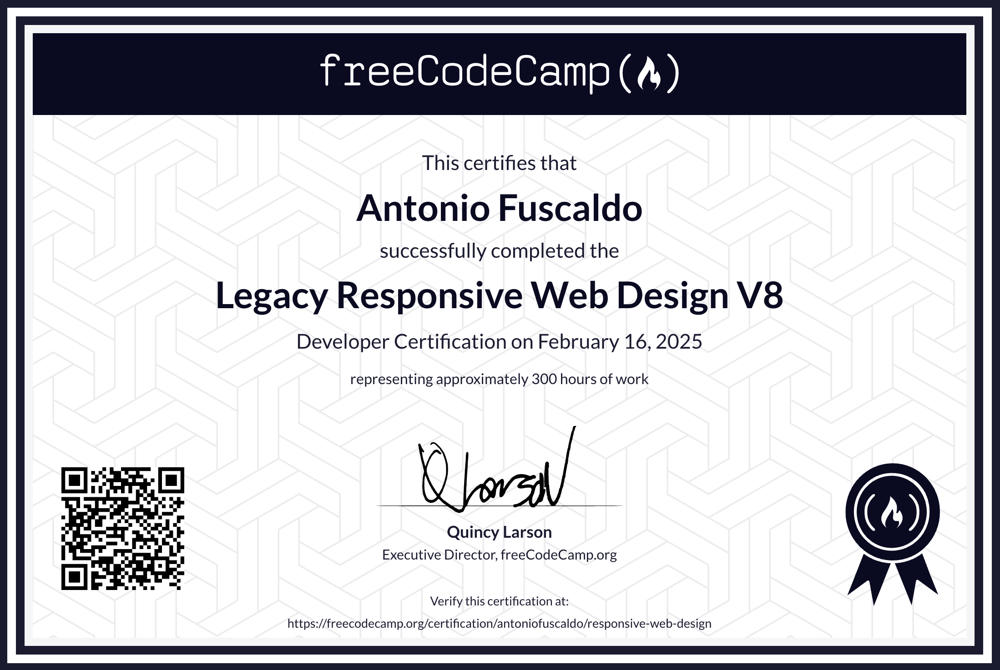
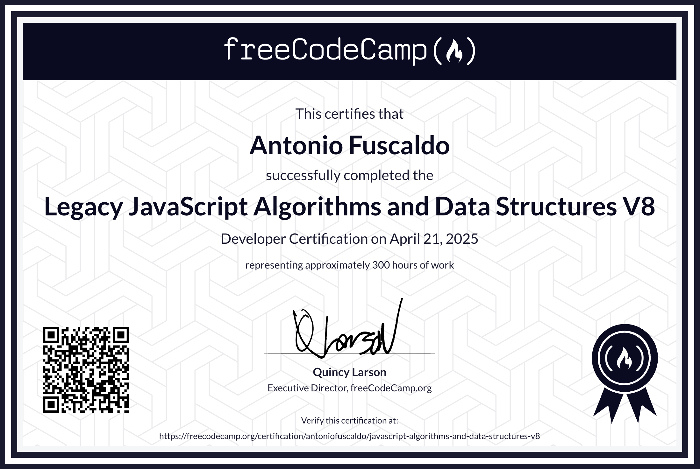

<!-- markdownlint-disable MD033 MD041 -->

  

## <a href="https://www.freecodecamp.org/antoniofuscaldo">
📜 freeCodeCamp Certifications - Antonio Fuscaldo
</a>

## 🟡 Certified Full Stack Developer Curriculum <em>(in progress...)</em>

### 🟢 Responsive Web Design (v9)

<a href="https://www.freecodecamp.org/certification/antoniofuscaldo/responsive-web-design-v9">Verify this certification</a>

---

### 🟢 Javascript (v9)

<a href="https://www.freecodecamp.org/certification/antoniofuscaldo/javascript-v9">Verify this certification</a>

---

### 🟢 B1 English for Developers Certification

<a href="https://www.freecodecamp.org/certification/antoniofuscaldo/b1-english-for-developers">Verify this certification</a>

---

### 🟢 A2 English for Developers Certification

<a href="https://www.freecodecamp.org/certification/antoniofuscaldo/a2-english-for-developers">Verify this certification</a>

---

---

### 🟢 Legacy Responsive Web Design (v8)

<a href="https://www.freecodecamp.org/certification/antoniofuscaldo/responsive-web-design">Verify this certification</a>

---

### 🟢 Legacy JavaScript Algorithms and Data Structures (v8)

<a href="https://www.freecodecamp.org/certification/antoniofuscaldo/javascript-algorithms-and-data-structures-v8">Verify this certification</a>

---

### 🟢 Front End Development Libraries (v8)

<a href="https://www.freecodecamp.org/certification/antoniofuscaldo/front-end-development-libraries">Verify this certification</a>

---

### 🟢 Data Visualization (v8)

<a href="https://www.freecodecamp.org/certification/antoniofuscaldo/data-visualization">Verify this certification</a>

---

### 🟢 Legacy Javascript Algorithms and Data Structures V7

<a href="https://www.freecodecamp.org/certification/antoniofuscaldo/javascript-algorithms-and-data-structures">Verify this certification</a>

---

## Avvertenza

  
⚠️ Attenzione

  <em>
    Questo repository ha finalità esclusivamente informative e di portfolio personale.
    I progetti e gli esempi qui pubblicati sono destinati a mostrare le mie capacità tecniche e il mio percorso di apprendimento.
    Non intendo in alcun modo incentivare, facilitare o giustificare la copia di soluzioni,
    l'uso improprio del codice o qualsiasi condotta finalizzata ad aggirare, falsare o ottenere
    indebitamente le certificazioni di freeCodeCamp o di altre piattaforme formative. L'unico scopo è educativo e dimostrativo.
      
    L'utilizzo dei contenuti è consentito per studio e ispirazione, nel rispetto delle buone pratiche accademiche e professionali.
    È vietato riutilizzare il materiale al fine di superare valutazioni o certificazioni dichiarando come proprie
    soluzioni derivate da questo repository.
      
    freeCodeCamp® è un marchio di freeCodeCamp.org. Questa repository non è affiliata, sponsorizzata né approvata da freeCodeCamp.org.
    Eventuali marchi di terzi appartengono ai rispettivi titolari e sono utilizzati a solo scopo descrittivo.
      
    L'uso del codice avviene "così com'è", senza garanzie di alcun tipo. L'autore non è responsabile per usi impropri,
    violazioni di regolamenti o danni derivanti dall'uso dei contenuti qui pubblicati.
  </em>

---

## Disclaimer

  
⚠️ Pay attention

  <em>
    This repository is intended solely for informational and personal portfolio purposes.
    The projects and examples published here are meant to demonstrate my technical skills and learning path.
    I do not intend to encourage, facilitate, or justify copying solutions, misuse of code, or any conduct aimed at
    cheating, falsifying, or improperly obtaining certifications from freeCodeCamp or other learning platforms. The sole purpose is educational and demonstrative.
      
    You may use the content for study and inspiration, in accordance with academic and professional best practices.
    It is prohibited to reuse the material for the purpose of passing assessments or certifications while presenting as your own
    solutions derived from this repository.
      
    freeCodeCamp® is a trademark of freeCodeCamp.org. This repository is not affiliated with, sponsored, or endorsed by freeCodeCamp.org.
    Third-party trademarks belong to their respective owners and are used for descriptive purposes only.
      
    All code is provided "as is", without warranties of any kind. The author is not responsible for improper use,
    violations of rules, or damages arising from the use of the content published here.
  </em>

