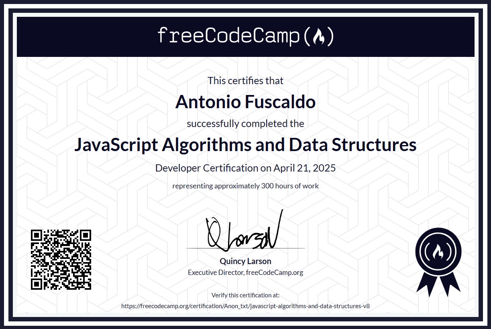

<a href="https://www.freecodecamp.org/">freeCodeCamp.org</a>

<h1>🔵 Responsive Web Design Certification</h1>

<figcaption>-> <a href="https://www.freecodecamp.org/certification/Anon_txt/responsive-web-design">Verify this certification</a> <-</figcaption>

<h1>🔵 JavaScript Algorithms and Data Structures</h1>

<figcaption>-> <a href="https://www.freecodecamp.org/certification/Anon_txt/javascript-algorithms-and-data-structures-v8">Verify this certification</a> <-</figcaption>

<h1>🔵 Front End Development Libraries</h1>

<i>(In progress... (40%))</i>

<h1>🔵 Certified Full Stack Developer Curriculum</h1>

<i>Coming soon...</i>

