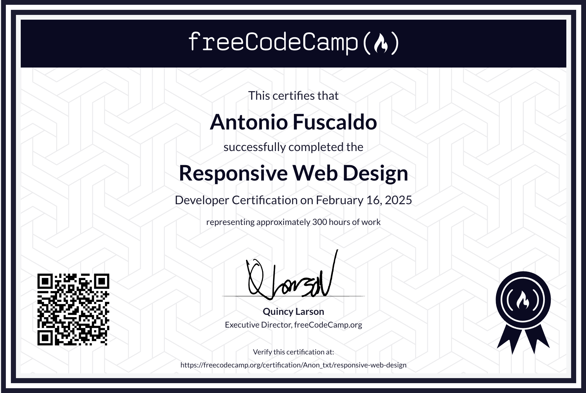

<a href="https://www.freecodecamp.org/"><h3 style="font-family:monospace; font-size:20px">freeCodeCamp.org</h3></a>

<h1 style="font-family:monospace; font-size:25px">Responsive Web Design Certification</h1>

<figcaption style="font-family:monospace; font-size:13px"><a href="https://www.freecodecamp.org/certification/Anon_txt/responsive-web-design">-> Verify this certification <-</a></figcaption>
